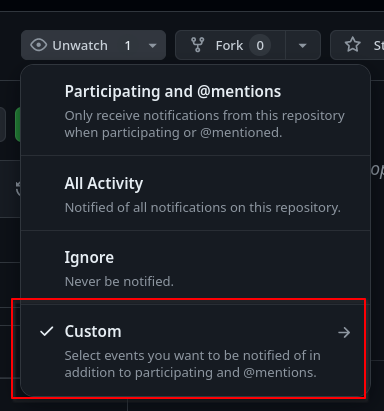
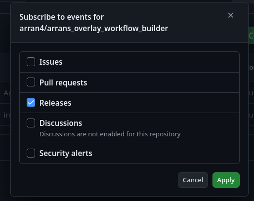

# arrans_overlay_workflow_builder_generator

This is a generator for some of the github actions in [my gentoo overlay](https://github.com/arran4/arrans_overlay/tree/main/.github/workflows)'s
workflow directory. 

The github actions it generates run daily and automatically keep my overlay up to date on the supported types. 

The basic idea is that:
* You update your own version of the configuration file (see [testdata/testinputconfig.config](testdata/testinputconfig.config))
* You install / build and then run this app with the configuration
* This tool produces a workflow based on the configuration data.
* You install the generated file in the `/.github/workflows` folder of the overlay see: `https://wiki.gentoo.org/wiki/Creating_an_ebuild_repository`
* THe workflow when run (everyday, manually, and upon change) will:
  * check for the latest version of the specified package 
  * If the latest doesn't have an ebuild
    * Create the ebuild
    * Download the binary to generate the manifest
    * Push the changes to the overlay the files are in

Please note: this tool is for VERY specific use cases. You will have to be prepared to modify it for yours if not included.

I will be updating this time to time, happy to accept PRs and to provide some level of help with others using this. Best to
watch the repo for releases to keep an eye on it.





## Usage:

Install it using the github releases packages, or compile it yourself locally and run it there:

```bash
go run ./cmd/generate/ help
```

```bash
go build ./cmd/generate/ 
./generate --help
```

## Generating an ebuild generator for: Projects with an AppImage on Github with Semantic versioning and that uses github releases

Using [testdata/testinputconfig.config](testdata/testinputconfig.config) as an example:
```
# Example config
Type Github AppImage
GithubProjectUrl https://github.com/janhq/jan/
DesktopFile jan
InstalledFilename jan
Category app-misc
EbuildName jan-appimage
Description Jan is an open source alternative to ChatGPT that runs 100% offline on your computer. Multiple engine support (llama.cpp, TensorRT-LLM)
Homepage https://jan.ai/
ReleasesFilename amd64=>jan-linux-x86_64-${VERSION}.AppImage
```

(You may specify multiple per file. Not all possible values are present.)

```bash
go run ./cmd/generate/ generate github-appimage -input-file testdata/testinputconfig.config
```

```bash
go build ./cmd/generate/ 
./generate github-appimage -input-file testdata/testinputconfig.config
```

Look in the `output/` directory for the generated file(s)